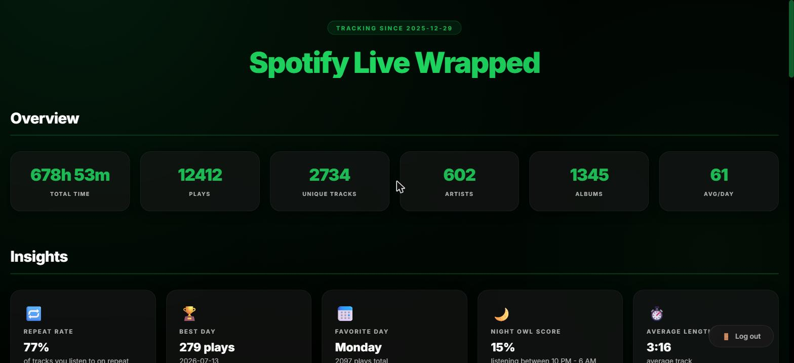
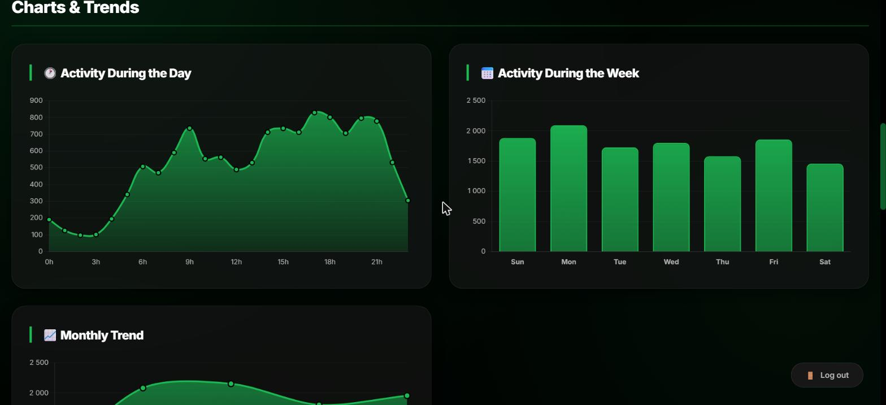
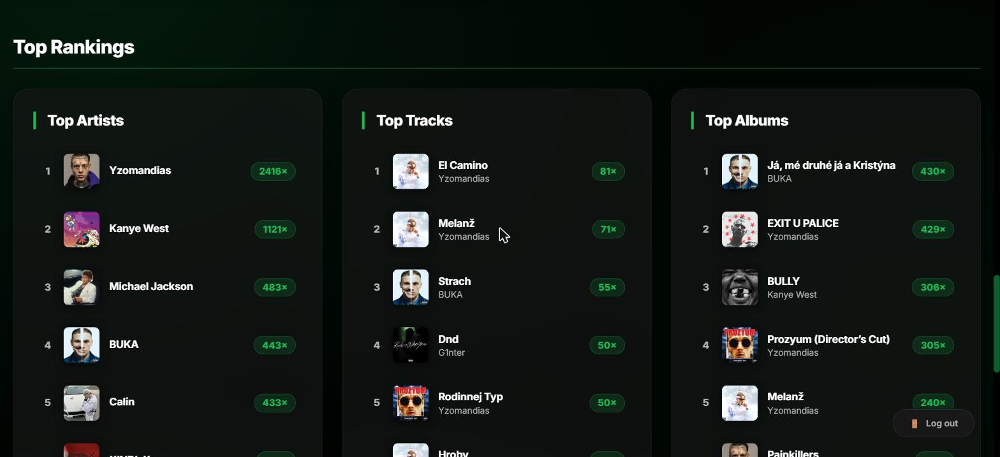

# 🎧 Spotify Live Wrapped

Your own 24/7 "Spotify Wrapped" — running on your own server, on your
own data. A background collector continuously pulls your listening
history from the Spotify Web API and a live dashboard turns it into
top artists, top tracks, top albums, activity charts, listening
streaks, a night-owl score, and more.

<p align="center">
  
</p>

## ✨ Features

- **Always-on collection** — a lightweight background worker polls
  your recently-played tracks every few minutes and stores them in
  SQLite, so nothing gets lost even if you're offline.
- **Live web dashboard** — password-protected Flask app with overview
  stats, insight cards (repeat rate, night owl score, listening
  streak, peak hours...), interactive charts, and top-10 rankings.
- **No secrets in the code** — every API key, admin password and
  session secret comes from `.env`, never hardcoded.
- **One-command Linux install** — `deploy/install.sh` sets up a venv,
  walks you through configuration, runs the one-time Spotify
  authorization, and can install systemd services for you.

## 📸 Screenshots

| Overview | Charts & Trends |
|---|---|
|  |  |

<p align="center">
  <br>
  <sub>Top artists / top tracks / top albums rankings, all-time</sub>
</p>

## 🏗 How it's built

Two independent processes share one SQLite database:

- **collector** (`app/collector.py`) — polls the Spotify API for
  recently-played tracks and followed artists, and writes new rows
  to `data/spotify_history.db`.
- **web** (`app/web.py`) — a Flask app that reads that database,
  computes the stats with pandas, and renders the dashboard.

## 🚀 Quick start (local)

Requires Python 3.10+ and a [Spotify Developer](https://developer.spotify.com/dashboard)
app (Client ID + Client Secret, Redirect URI set to
`http://127.0.0.1:8080` or your own).

```bash
python3 -m venv .venv
source .venv/bin/activate        # Windows: .venv\Scripts\activate
pip install -r requirements.txt

cp .env.example .env
# fill in SPOTIFY_CLIENT_ID / SPOTIFY_CLIENT_SECRET / SPOTIFY_REDIRECT_URI,
# ADMIN_USERNAME / ADMIN_PASSWORD and FLASK_SECRET_KEY in .env

python scripts/authorize.py      # one-time Spotify account authorization
python app/collector.py          # terminal 1 - data collection
python app/web.py                # terminal 2 - dashboard on http://localhost:5000
```

## 🐧 Deploying to a Linux server

The repo ships an installer that creates a virtual environment, walks
you through entering your API keys and login credentials (written
straight to `.env`, nothing gets committed), runs the Spotify account
authorization, and can optionally install both services as systemd
units.

```bash
git clone <this-repo-url> spotify-live-wrapped
cd spotify-live-wrapped
bash deploy/install.sh
```

The installer will ask for:

1. Spotify `CLIENT_ID` / `CLIENT_SECRET` / `REDIRECT_URI`
2. Login username and password for the web dashboard
   (`FLASK_SECRET_KEY` is generated automatically)
3. Whether to run the Spotify account authorization right away (it
   prints a link, you open it in a browser, log in, and paste the
   resulting redirect URL back — the token then refreshes itself)
4. Whether to install the `spotify-collector` and `spotify-web`
   systemd services (background execution + start on boot)

Unit templates live in `deploy/systemd/`. The web app runs behind
`gunicorn` (see `requirements.txt`); the collector is a plain Python
process.

Useful commands after installing:

```bash
sudo systemctl status spotify-web spotify-collector
sudo journalctl -u spotify-web -f
sudo journalctl -u spotify-collector -f
```

If the web app shows "The app isn't configured yet", something is
missing from `.env` — fill it in and run
`sudo systemctl restart spotify-web`.

## ⚙️ Configuration (.env)

See `.env.example` for the full list of variables. None of this is
committed — `.env`, `data/` (database + OAuth token cache) and
`.venv/` are all in `.gitignore`.

| Variable | Description |
|---|---|
| `SPOTIFY_CLIENT_ID`, `SPOTIFY_CLIENT_SECRET`, `SPOTIFY_REDIRECT_URI` | API keys from the Spotify Developer Dashboard |
| `ADMIN_USERNAME`, `ADMIN_PASSWORD` | login for the web dashboard |
| `FLASK_SECRET_KEY` | signs the Flask session cookie — a random hex string |
| `APP_TITLE` | name shown in the UI (default "Spotify Live Wrapped") |
| `WEB_HOST`, `WEB_PORT` | what the web app listens on (default `0.0.0.0:5000`) |
| `COLLECT_INTERVAL_SECONDS` | how often the collector polls for new data (default 600s) |
| `DATA_DIR` | where `spotify_history.db` and `.cache` are stored (default `./data`) |

## 🔒 Security notes

- No API keys or passwords live in the code — everything goes
  through `.env`.
- `data/` holds your personal listening history and OAuth token —
  never commit or share it.
- The dashboard is protected by a username/password, but if it's
  reachable on a public IP, put it behind a reverse proxy with HTTPS
  (nginx/caddy).

## 📄 License

[PolyForm Noncommercial License 1.0.0](LICENSE) — personal,
noncommercial use is fine (study it, self-host it, modify it for
yourself). Commercial use requires the author's permission.
